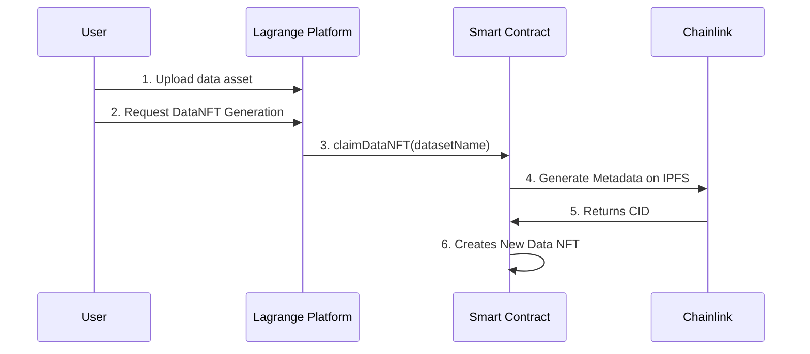

# DataNFT for Dataset Licensing

https://www.lagrangedao.org/

DataNFT for Dataset Licensing is a platform that allows dataset owners to tokenize their datasets uploaded on the Lagrange Platform and grant access to others users via NFTs. It utilizes blockchain technology to validate ownership and access rights, ensuring a secure and transparent ecosystem.

## What is a Data NFT? 🤔

A Data NFT represents the ownership and rights for a specific data asset on the blockchain. The owner has the claim on the base intellectual property and can distribute sub-licenses to other users, giving them permission to access the data.

This project establishes ownership of data assets, which would allow for data transferability and data sales while maintaining a verifiable record of ownership. It also allows data owners to define who can access the data, for what purposes, and under what conditions, in order to protect their own intellectual property.

This project would enable the tokenization of the base intellectual property, allows for easy transfer and trade of ownership, and provides opportunities for revenue generation through the creation and sale of datatokens associated with the underlying data. Data NFTs also maintain a verifiable record of ownership. It also allows data owners to define who can access the data, for what purposes, and under what conditions, in order to protect their own intellectual property.

## Workflow 🧩

1. Users onboard their data onto Lagrange Platform
2. Users click Generate dataNFT button on frontend
3. Frontend will call smart contract function to create dataNFT
   1. User will sign the transaction on MetaMask
   2. Chainlink Oracle will generate metadata and upload to IPFS
   3. Chainlink Oracle returns CID to contract
   4. Contract deploys new Data NFT contract
4. Frontend displays information about the dataNFT

## Technologies Used 🛠

The Lagrange Platform creates new Data NFTs via the DataNFTFactory contract.

The Data NFTs are implemented using the ERC721 standard. Built on top of the OpenZeppelin contract library and implement the ChainlinkClient library. In the future we plan to migrate to Chainlink Functions, which is currently in BETA.

## Contract Addresses 📜

Below are the contract addresses of the DataNFTFactory for each network. They are all using the same contract address!

| Network         | Address                                    |
| --------------- | ------------------------------------------ |
| Binance Testnet | 0xE74b3DC8B3935591003B79745DD6072ACE3e6dA7 |
| Mumbai Testnet  | 0xE74b3DC8B3935591003B79745DD6072ACE3e6dA7 |
| Polygon Mainnet | 0xE74b3DC8B3935591003B79745DD6072ACE3e6dA7 |

## Contributing 🤝

We encourage you to create issues in this repo with any concerns or suggestions.
