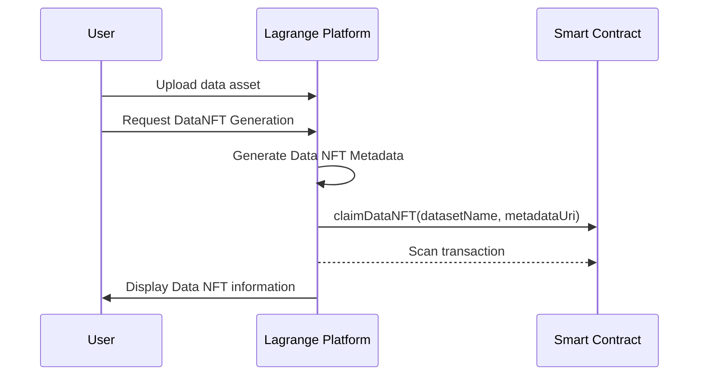

# DataNFT for Dataset Licensing

https://www.lagrangedao.org/

DataNFT for Dataset Licensing is a platform that allows dataset owners to tokenize their datasets uploaded on the Lagrange Platform and grant access to others users via NFTs. It utilizes blockchain technology to validate ownership and access rights, ensuring a secure and transparent ecosystem.

## What is a Data NFT? 🤔

A Data NFT represents the ownership and rights for a specific data asset on the blockchain. The owner has the claim on the base intellectual property and can distribute sub-licenses to other users, giving them permission to access the data.

This project establishes ownership of data assets, which would allow for data transferability and data sales while maintaining a verifiable record of ownership. It also allows data owners to define who can access the data, for what purposes, and under what conditions, in order to protect their own intellectual property.

This project would enable the tokenization of the base intellectual property, allows for easy transfer and trade of ownership, and provides opportunities for revenue generation through the creation and sale of datatokens associated with the underlying data. Data NFTs also maintain a verifiable record of ownership. It also allows data owners to define who can access the data, for what purposes, and under what conditions, in order to protect their own intellectual property.

## Workflow 🧩

- Users onboard their data onto Lagrange Platform
- Generate dataNFT on frontend
- Backend will generate metadata
- Frontend will call smart contract to claimDataNFT
- User will sign the transaction on MetaMask
- After the transaction is complete, frontend displays information about the dataNFT

Here is a simple flow chart:



## Technologies Used 🛠

- The frontend was written in Vue.js
- The backend was written in Python
- The Data NFTs are implemented using the ERC721 standard. Built on top of the widely-used OpenZeppelin contract library and deployed on the Filecoin Hyperspace Testnet, utilizing FEVM technology.

  - DataNFT Factory contract address: `0x93C2aB6d92b3d40DEcf3eaFEA2B8b539EE78738e`

<!--
## Deploying Contracts 📜

For those interested on deploying their own DataNFTFactory contract:

Clone the repository:

```bash
git clone https://github.com/lagrangedao/datanft
cd datanft

npm install
```

Create a .env file with your private key:

```python
# datanft/.env
PRIVATE_KEY="..."
```

Deploy the contract to FEVM Hyperspace:

```bash
npx hardhat run scripts/deploy.js --network hyperspace
```

Add the outputted address into `scripts/claimDataNft.js`.

```js
const FACTORY_ADDRESS = '0x...'
```

Then run the script to create an example Data NFT:

```bash
node scripts/createDataNft.js
``` -->

## Future Enhancements: 🔮

We want to allow users to sub-license their data assets to other wallet addresses, effectively giving those users permission to access the asset according to the terms in the sub-license. Different sub-licenses would define different usage and duration.

In the future we plan to integrate Chainlink Functions into our contracts to setup Lagrange DAO to be a data validator. We want to make sure users own the data they are minting as dataNFTs/

## Contributing 🤝

We encourage you to create issues in this repo with any concerns or suggestions.
