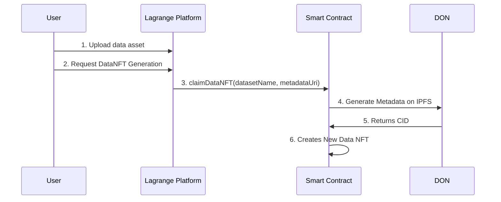

# DataNFT for Dataset Licensing
DataNFT for Dataset Licensing is a platform that allows dataset owners to tokenize their datasets uploaded on the Lagrange Platform and grant access to others users via NFTs. It utilizes blockchain technology to validate ownership and access rights, ensuring a secure and transparent ecosystem.

[](https://youtu.be/dAIiY5dw-6c)


## What is a Data NFT? 🤔

A Data NFT represents the ownership and rights for a specific data asset on the blockchain. The owner has the claim on the base intellectual property and can distribute sub-licenses to other users, giving them permission to access the data.

This project establishes ownership of data assets, which would allow for data transferability and data sales while maintaining a verifiable record of ownership. It also allows data owners to define who can access the data, for what purposes, and under what conditions, in order to protect their own intellectual property.

This project would enable the tokenization of the base intellectual property, allows for easy transfer and trade of ownership, and provides opportunities for revenue generation through the creation and sale of datatokens associated with the underlying data. Data NFTs also maintain a verifiable record of ownership. It also allows data owners to define who can access the data, for what purposes, and under what conditions, in order to protect their own intellectual property.

## Workflow 🧩



1. Users onboard their data onto Lagrange Platform
2. Users click Generate dataNFT button on frontend
3. Frontend will call smart contract function to create dataNFT
   1. User will sign the transaction on MetaMask
   2. DON will generate metadata and upload to IPFS
   3. DON returns CID to contract
   4. contract deploys new Data NFT contract
4. Backend will scan network for the transaction
5. Frontend displays information about the dataNFT

## Technologies Used 🛠

- The frontend was written in Vue.js
- The backend was written in Python
- The Data NFTs are implemented using the ERC721 standard. Built on top of the widely-used OpenZeppelin contract library and implements the beta Chainlink Functions, deployed on the Sepolia Testnet

  - DataNFT Factory contract address: `0x70bc8584313e2A854A321e68F6854ec767D69131`

<!--
## Deploying Contracts 📜

For those interested on deploying their own DataNFTFactory contract:

Clone the repository:

```bash
git clone https://github.com/lagrangedao/datanft
cd datanft

npm install
```

Create a .env file with your private key:

```python
# datanft/.env
PRIVATE_KEY="..."
```

Deploy the contract to FEVM Hyperspace:

```bash
npx hardhat run scripts/deploy.js --network hyperspace
```

Add the outputted address into `scripts/claimDataNft.js`.

```js
const FACTORY_ADDRESS = '0x...'
```

Then run the script to create an example Data NFT:

```bash
node scripts/createDataNft.js
``` -->

## Award
This project is arwarded the 1st place of NFTs and Gaming category ($15,000) of Chainlink Spring 2023 Hackathon 

[Announcing the Chainlink Spring 2023 Hackathon Winner](https://blog.chain.link/spring-2023-hackathon-winners)


## Contributing 🤝

We encourage you to create issues in this repo with any concerns or suggestions.
